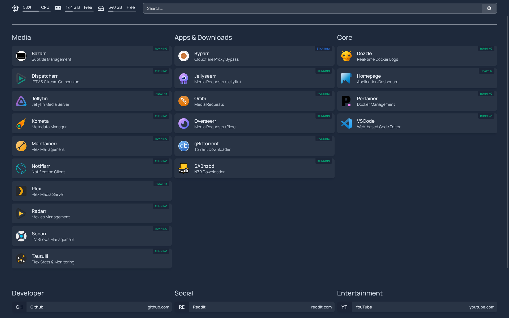

<div align="center">

# Erenyx Lab

**A personal infrastructure environment built for learning, breaking, and solving real problems.**
**Every problem documented. Every solution linked.**


</div>

---

## Quick Controls

<details>
<summary><strong>Open quick navigation</strong></summary>

| Jump                                           | Purpose                            |
| ---------------------------------------------- | ---------------------------------- |
| [Dashboard](#dashboard-panel)                  | See current lab health at a glance |
| [Hardware](#hardware-inventory)                | Check physical inventory and roles |
| [Services](#what-is-running)                   | View active workloads              |
| [Network](#network)                            | Understand routing and topology    |
| [Problems](#documented-problems-and-solutions) | Review solved constraints          |
| [Goals](#goals)                                | Track upcoming milestones          |

</details>

---

## Dashboard Panel

> README dashboard view of current lab state.

| Panel        | Live State                                                                                                     |
| ------------ | -------------------------------------------------------------------------------------------------------------- |
| Lab State    |                             |
| Infra Node   |  |
| WAN Edge     |                         |
| Containers   |  |
| Storage      |   |
| Access Layer |                             |

### Dashboard Screenshot



<details>
<summary><strong>Open dashboard style snippet (copy and adapt)</strong></summary>

```md
## Dashboard Panel

| Panel        | Live State                                                                                                     |
| ------------ | -------------------------------------------------------------------------------------------------------------- |
| Lab State    |                             |
| Containers   |  |
| WAN Edge     |                         |
| Access Layer |                             |


```

</details>

---

## What is Erenyx Lab

Erenyx Lab is my personal homelab — a physical infrastructure environment
built entirely from second-hand hardware, designed for hands-on learning,
real-world problem solving, and running self-hosted services.

Every device has a purpose. Every problem encountered is documented with its
full context, research process, and solution. This is not a simulated
environment. This is real hardware solving real problems.

---

## Hardware Inventory

| Device               | Role                                 | CPU                       | RAM           | Storage                                                                   |
| -------------------- | ------------------------------------ | ------------------------- | ------------- | ------------------------------------------------------------------------- |
| HP Z440 Workstation  | Proxmox hypervisor                   | Xeon E5-2698 v4 (20c/40t) | 64GB DDR4 ECC | 960GB SSD (VMs) + 1.5TB HDD (ISO/backups) + 1TB HDD (TrueNAS passthrough) |
| Intel NUC8 i7 (NUC1) | Primary Docker server                | Core i7-8559U             | 24GB          | 500GB NVMe                                                                |
| Intel NUC8 i3 (NUC2) | Testing and experiments              | Core i3-8109U             | 16GB          | 500GB NVMe + 500GB SSD                                                    |
| Raspberry Pi 4B      | Edge testing / lightweight services  | Cortex-A72 (4c)           | 8GB           | 64GB MicroSD                                                              |
| TP-Link AX23         | LAN switch and wireless access point | -                         | -             | AP mode for Erenyx WiFi                                                   |

> All hardware acquired from the second-hand market — proof that a serious
> lab does not require a serious budget.

---

## What is Running

### HP Z440 — Proxmox Host

| VM                    | Purpose                                                                                                 | Status |
| --------------------- | ------------------------------------------------------------------------------------------------------- | ------ |
| Alpine WiFi Bridge VM | PCIe WiFi passthrough VM connected to shared WiFi, performs WiFi-to-eth0 NAT bridge toward OPNsense WAN | Active |
| OPNsense Firewall VM  | WAN edge firewall for the full lab, WAN from Alpine bridge and LAN on Proxmox virtual bridge            | Active |
| EVE-NG CE             | Network simulation and CCNA/CCNP lab environment                                                        | Active |
| TrueNAS CE            | Network attached storage with PCIe passthrough HDD                                                      | Active |

> Planning: Additional 1TB HDD for TrueNAS RAID testing and redundancy experiments.

### NUC1 — Docker Server

Running 20 containerised services across three categories:

**Media stack:** Plex, Jellyfin, Radarr, Sonarr, Bazarr, Kometa,
Maintainerr, Notifiarr, Tautulli, Dispatcharr

**Apps and downloads:** Overseerr, Jellyseerr, Ombi, Byparr,
qBittorrent, SABnzbd

**Core infrastructure:** Portainer, Homepage, Dozzle, VSCode Server

> Full Docker stack documentation → [services/docker-stack.md](services/docker-stack.md)

### NUC2 and Raspberry Pi 4B

Currently used for testing and disposable experiments.
Future role being planned as the lab evolves.

---

## Network

| Segment           | Details                                                                            |
| ----------------- | ---------------------------------------------------------------------------------- |
| WAN Source        | Shared upstream WiFi connection - no owned ISP line                                |
| WiFi Bridge       | Alpine WiFi Bridge VM uses PCIe WiFi passthrough and bridges WiFi to eth0 with NAT |
| Firewall          | OPNsense VM is the WAN edge for the entire lab                                     |
| LAN Core          | OPNsense LAN is connected to Proxmox management virtual bridge                     |
| Access Layer      | TP-Link Archer AX23 is connected to physical NIC and serves as switch plus AP      |
| Connected Devices | NAS, NUC1, NUC2, Raspberry Pi 4B, and laptop clients via Erenyx WiFi               |
| VLANs             | Planned — segmentation by device role                                              |

> Full network topology and routing flow -> [network/topology.md](network/topology.md)

---

## Documented Problems and Solutions

The core of this repository. Every real problem encountered in this lab
has a dedicated repository with full documentation.

| Problem                                                                          | Solution Repo                                                                   | Status    |
| -------------------------------------------------------------------------------- | ------------------------------------------------------------------------------- | --------- |
| No owned internet - built a wireless uplink bridge path for homelab connectivity | [wireless-uplink-bridge-docs](https://github.com/farhathmh/openwrt-wifi-as-wan) | Completed |

> Next: wireless uplink bridge series documentation with additional architecture options.

> More solutions added as the lab grows.

---

## Goals

- [ ] Full VLAN segmentation across all devices
- [ ] Centralised monitoring — Grafana and Prometheus across all nodes
- [ ] TrueNAS RAID setup and redundancy testing
- [ ] Automated backup solution across all nodes
- [ ] CI/CD pipeline for homelab configuration management
- [ ] Document every problem and solution as it happens

<details>
<summary><strong>Milestone View</strong></summary>

| Track                | Stage    |
| -------------------- | -------- |
| Network segmentation | Planning |
| Monitoring stack     | Planning |
| Storage resilience   | Research |
| Infra automation     | Backlog  |

</details>

---

## Hardware Details

- [HP Z440 — Proxmox Host](hardware/hp-z440.md)
- [NUC1 — Docker Server](hardware/nuc1-docker-server.md)
- [NUC2 — Testing Node](hardware/nuc2-testing.md)
- [Raspberry Pi 4B](hardware/rpi4b.md)

---

<div align="center">
<sub>Built and maintained by <a href="https://github.com/farhathmh">Farhath Manas</a>
 — because the best way to learn is to build it yourself.</sub>
</div>
