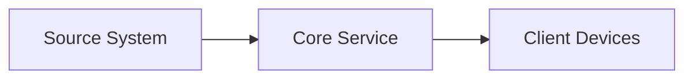

# Project Title

**One-line technical value statement.**

---

## Quick Controls

<strong>Open quick navigation</strong>

| Jump | Purpose |
|------|---------|
| [Dashboard](#dashboard-panel) | Snapshot of project health |
| [Architecture](#architecture) | Topology and components |
| [Implementation](#implementation) | Build and configuration steps |
| [Validation](#validation) | Checks to confirm success |
| [Roadmap](#roadmap) | Next milestones |

---

## Dashboard Panel

| Signal | State |
|--------|-------|
| Project State |  |
| Services |  |
| Last Update |  |

<strong>Panel notes</strong>

- Replace badges with real project KPIs.
- Keep labels short and consistent.
- Update the date badge whenever major changes land.

---

## Architecture

---

## Implementation

1. Describe setup step one.
2. Describe setup step two.
3. Describe setup step three.

---

## Validation

- [ ] Service reachable from LAN.
- [ ] Authentication and access tested.
- [ ] Logs show no critical errors.

---

## Roadmap

| Item | Stage |
|------|-------|
| Observability integration | Planning |
| Backup and restore testing | Backlog |
| Automation hardening | Backlog |
